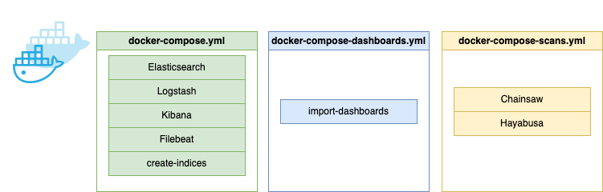
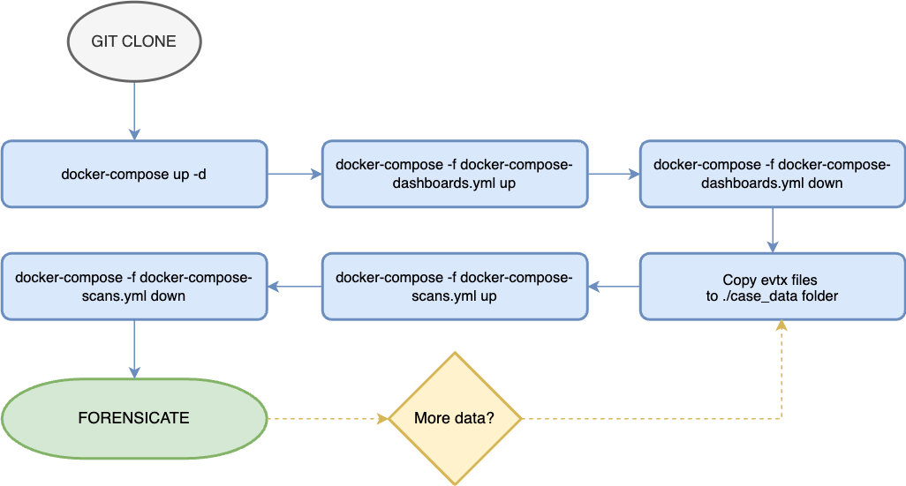
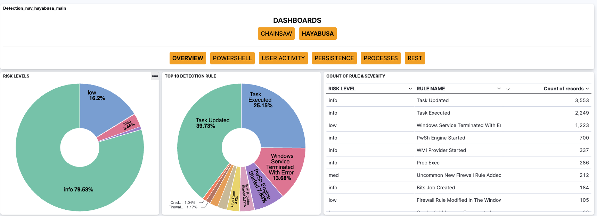

# The DFIR thing
The DFIR thing is a project which is meant to be used to parse and analyze data for DFIR purposes. The main idea is to use docker and docker-compose to make it easy to launch a new environment when needed.

Supported evidence:
* Evtx logs are being parsed and they are not parsed as raw. Rather the data is parsed with Chainsaw and Hayabusa. The results are sent to ELK for investigation purposes.
* Registry files - the script can look for the reg files from the case_data folder and replay logs if needed - the solution runs Regipy plugins against the data and does NOT parse full raw data. *The data ingestion ELK is WIP* 

The main idea is to bring quick results rather than parsing and importing all the data.
## The configuration
The current version is a combination of three different docker-compose files which are launching a set of different containers. The following diagram represents the three files:

### docker-compose.yml
This is the main configuration which launches the ELK stack, Filebeat and also a container known as create-incides. The create-indices container is creating the indices for Chainsaw and Hayabusa. The reason for running the container is that if it is not done the Hayabusa ingestion will fail. Some of the fields on Hayabusa output has wrong data type so if the ELK is automatically setting the contents it is likely that those fields will be set to numerical values and some of the other content can't be ingested because of wrong data type. The creation of the indices makers sure that those fields are set as string data type. Also it adds limitation of unique fields to 2000, which is also required as I am using the super-verbose option on Hayabusa which creates a massive amounts of fields.

**Beware!** Although this fixes most of the ingestion issues of Hayabusa it is still not able to ingest 100% of events; the details field should be an object but on some events it contains concrete data. Those fields will be sent to Dead Letter Queue as they can't be parsed.

### docker-compose-dashboards.yml
This file is fairly simple. It is importing the Kibana saved objects to the ELK stack so that the visualizations are available. It needs to be run separately at your own will.

### docker-compose-scans.yml
This one is launching the Chainsaw and Hayabusa containers. The containers target the case_data subfolder - all the evidence files which you would like to parse should be placed to this folder before running the container. The folder structure does not matter.

## Running the DFIR thing
It should be relatively easy to use for anyone who has support for docker. Follow these easy steps:

1. Clone the Git repository Place your evidence files to the case_data folder. The containers are able to find them from subfolders so the structure is not very important. 
1. Start the ELK stack (in  root of the cloned repo): *docker-compose up -d*
1. Wait for the stack to start. Browse to http://localhost:5601 to see that the ELK stack is up and responding. There should be two indices now.
1. Import dashboards with the following command (in  root of the cloned repo): *docker-compose -f docker-compose-dashboards.yml up*
1. You should now be able to see the dashboards.
1. Remove the dashboards container: *docker-compose -f docker-compose-dashboards.yml down*
1. To parse your evidence from the case_data folder run the following command: docker-compose -f docker-compose-scans.yml up
1. After Chainsaw and Hayabusa containers are successfully launched the data is automatically picked up by Logstash and sent to elasticsearch. The Kibana dashboards should be working.
1. Regipy container will start after the Chainsaw and Hayabusa have finished. The data is not currently ingested to ELK but rather the JSON files are saved under the ./logstash/ingest/regipy_json -folder and needs to be analyzed by other means.
1. Remove the scans container: *docker-compose -f docker-compose-scans.yml down*
1. Start forensicating using Kibana.

## Dashboards

The overview gives you an overview of the data. At the bottom of the page (actually bottom of all the dashboards) you can find a timeline of the data where you can see all the events which hit the filters.
* Overview: All the events, no filters. The timeline at the bottom of the dashboards only has high level information
* Powershell: Powershell related events. 
* User activity: Mostly logon events, but also has things like group additions
* Persistence: Persistence related events.
* Processes: Process launches.
* REST: All the events which do not hit on the previous filters.

The Chainsaw is quite similar but it is more limited. Honestly, the Hayabusa brings in much more details and data so I think it is a better tool for this particular approach. I might remove Chainsaw completely in the future, the reason why I have both is that I wanted to learn how this approach works, create the containers, and all that. So it was mostly for my personal learning experience.

## File structure
* **case_data/** - contains all the evtx files to be parsed. Empty when a clean env is cloned.
* **chainsaw/** - contains the chainsaw docker image.
* **config/** - contains the config files for ELK stack. 
* **dashboards/** - contains the dashboards to be imported to Kibana.
* **elasticsearch/** - contains the elasticsearch persistent data.
* **filebeat/** - contains ingestion for couple of web servers by filebeat. Not really used currently but you can use it to ingest web server logs. No dashboards or anything.
* **hayabusa/**  - contains the Hayabusa docker image.
* **logstash/** - contains the logstash files, the configurations, ingestion folders for the data, persistent data.
* **docker-compose-dashboards.yml** - importing the dashboards.
* **docker-compose-scans.yml** - running Chainsaw and Hayabusa.
* **docker-compose.yml** - running ELK.
* **createindices.sh**  - used by the ELK configuration for creating the indices over the API.
* **import.sh** - used to import the dashboards over the API.
* **regipy** - contains files related to the registry parsing.

# Links
* [Hayabusa](https://github.com/Yamato-Security/hayabusa)
* [Chainsaw](https://github.com/WithSecureLabs/chainsaw)
* [My blog](https://threathunt.blog/the-dfir-thing/)
* [Youtube series part 1](https://youtu.be/BBmrj9-slpA)
